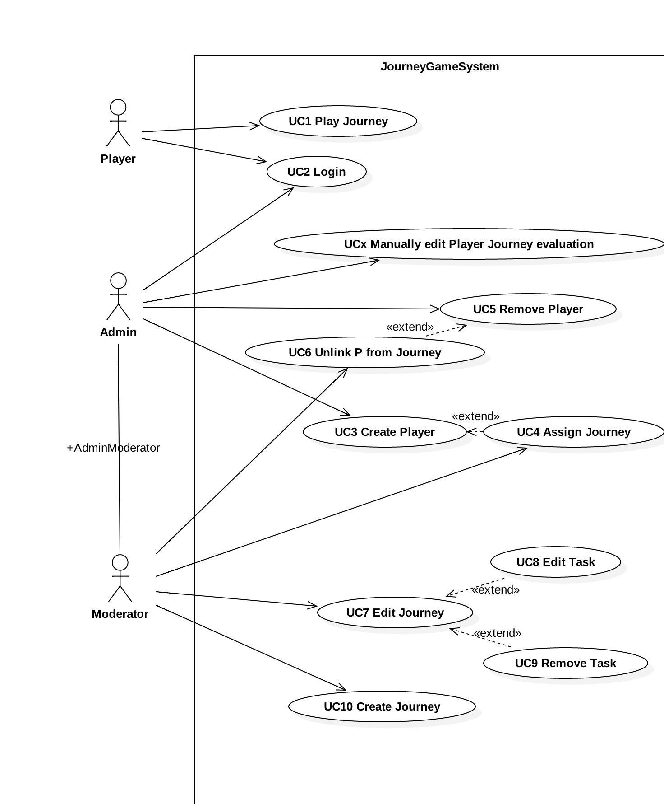
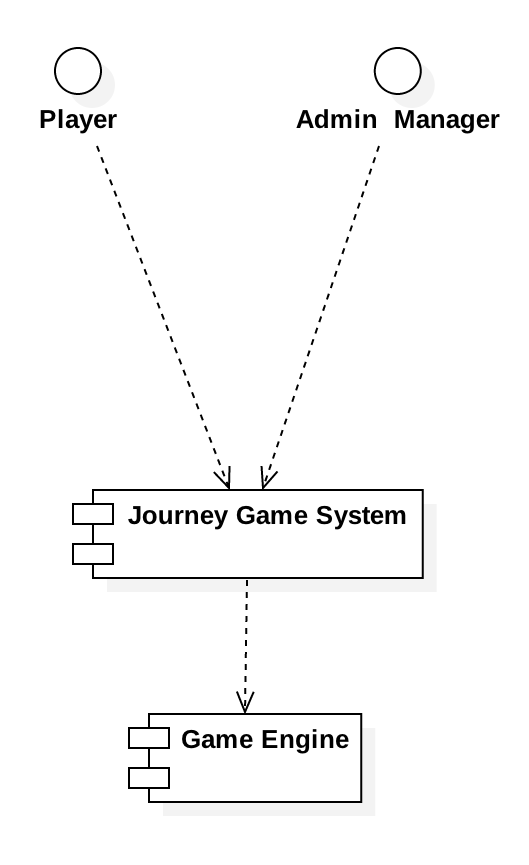
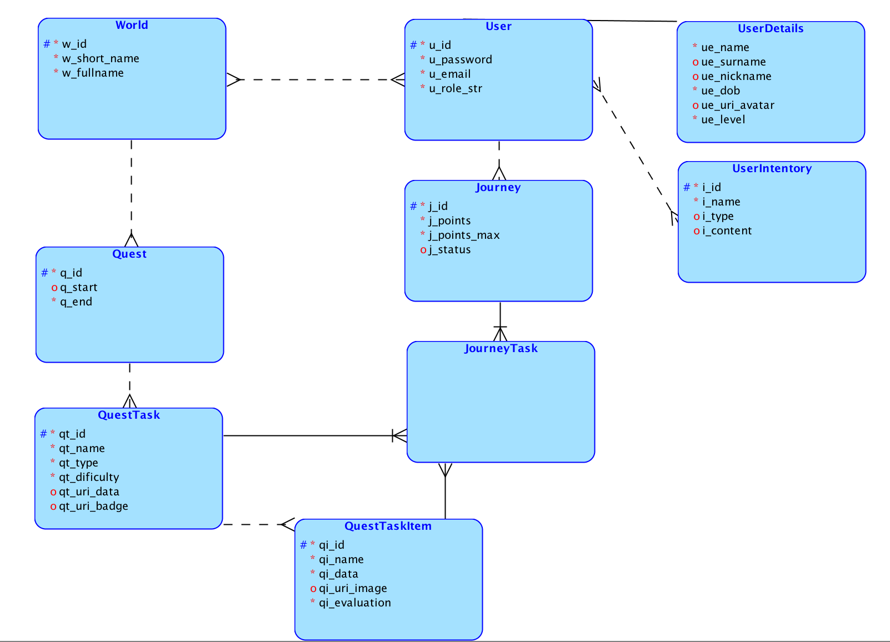
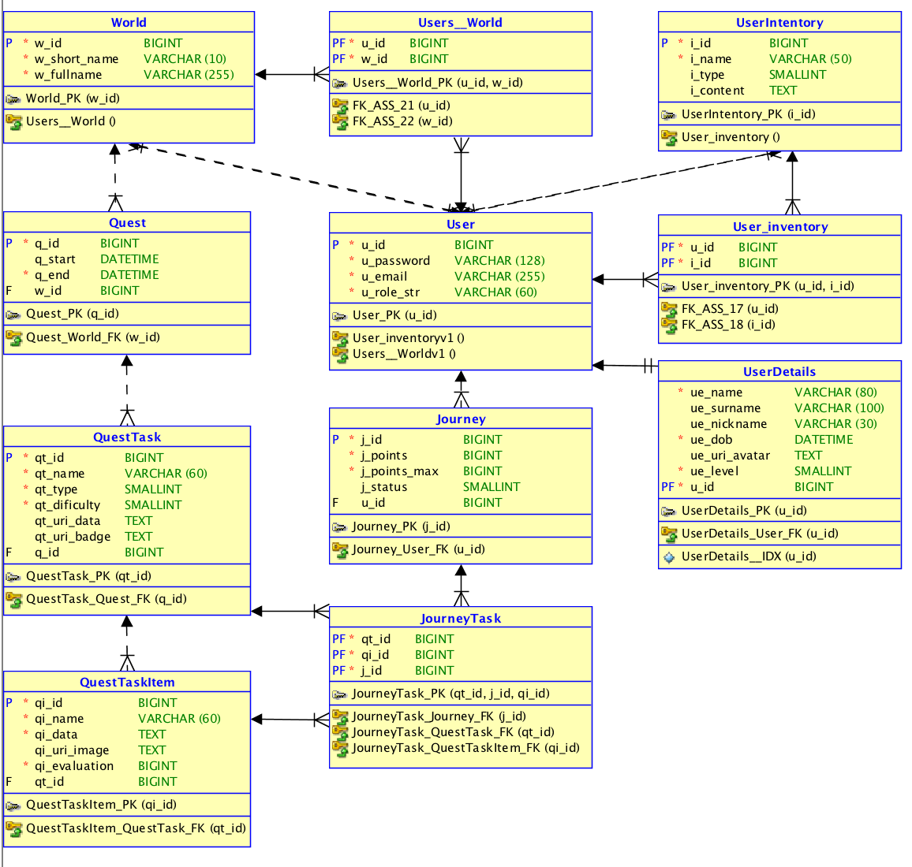
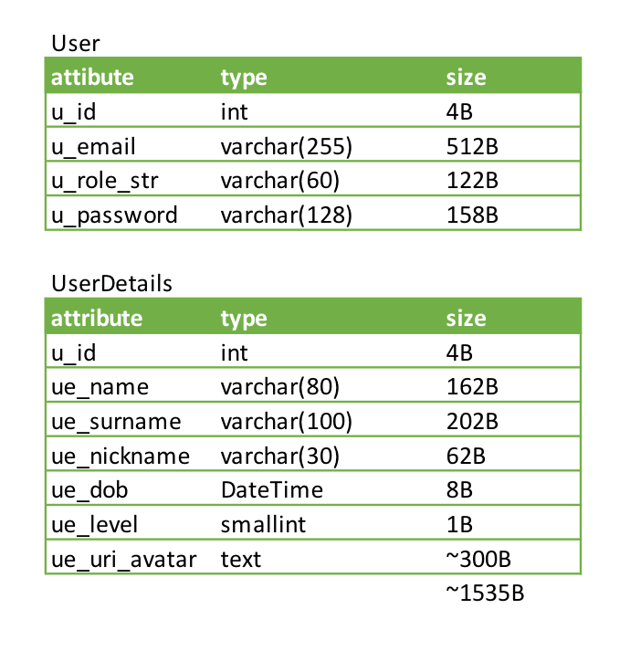
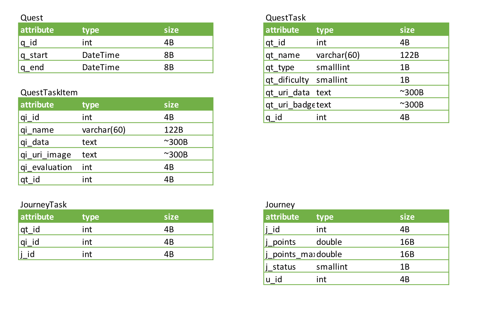

Tomas Michalek <tomas.michalek.st@vsb.cz>

MIC0220

UDBS Semestral project | Journey master 2.0.1 - SRS
======================================================

## 1 Introduction

### 1.1 Purpose of this document

This document specifies *S*oftware *R*requirements *S*pecification of the mobile
port of the old code-base, with file-based backend. Since the community grew up
and the demand for faster, more streamlined experience has risen. After online
discussion the development team deviced, that to allow mobile access and to connect
user-scenarios created on the forum, the *DB* backend was proposed and agreed upon.

### 1.2 Scope
The large part of the game engine itself is already ported to web environment using
Web 2.0 stack_(NodeJS, CSS3, AngularJS, WebSockets)_. As such all of the components
of the game engine are discribed in separate document called  [JM Game engine SRS](JM-GE-SRS.md).

This document focuses on the data analysis and reqirements. It specifies the
implementation details such as HW & SW requrements as well as specifies the datatypes
and structures of stored data.

### 1.3 Definitions, acronyms and abbreviations

|   Definition   |              Description         	|
|  :----------:  |  :-------------------------------:  	|
| 	JM	 |  Journey master     			|
|	JME	 |  Journey master engine		|
|	SRS	 |  Software Requirement Specification	|
|	DB	 |  Database				|
|      D&D	 |  Dungeons & Dragons			|
|	v\*	 |  version *				|

### 1.4 References
### 1.5 Overview

## 2 Vision & purpose

### 2.1 WHAT

The Journey master is the new port of game with established ABI, which the project 
is trying to put on the web for mobile access. It has additional ability to 
connect players via forum and such, which was not possible with previous project.

### 2.2 HOW

The current iteration of JME (Journey master engine) uses files as storage for the
quest file. Community expanded it with it’s own versions and enhancements and those
the current system is sluggish and cannot be used anymore. Moreover because of
initial preposition of only several quest, no mind was paid to performance impact 
of opening multiple files and searching inside them.

### 2.3 WHO will use the system

Journey master is played by enthusiasts of _D&D_ rules _v_5+. Who use it regularly 
to battle quick or longer quest or to challenge they follow journeyman. Normal 
session is played weekly with Guild consisting of minimally 2 players (called party)
and of maximum (currently) 10 players.

The guild abstraction and award system is already implemented and as such 
is not part of the specification of the Journey master port.

### 2.4 WHEN will the system be used

The JM is used weekly by community, which shedules the meeting via current forum.
The new and improved session provides faster way to shedule and play the games 
thouse the interaction with the server are expeceted to increase.

## 3 Events & reactions

### 3.1 Use cases

### 3.2 Context Diagram 

### 3.3 E&R

| Actor  | Event                    | Reaction                                                |
| :----  | :----------------------- | :------------------------------------------------------ |
| Player | Asks for new adventure   | Display list of JourneyTasks                            |
| Player | Completes Journey task   | Save the progress to DB                                 |
| Player | Asks for journeys hist   | Display list of journeys with progress                  |
| Admin  | Create journey           | Create new jour. with multiple types of tasks and items |
| Moder. | Assign player to journey | Creates connections between entities (P-J)              |
| Sys.   | Create player            | Create new player account with random password          |

Sys.   = System    ~> Players are normally created via OAuth API (fallback Admin).

Moder. = Moderator ~> Lover access level than Admin, higher than player.

[//]: # (Data analysis)

# 4 Data analysis

## 4.1 Linear notation

### Tables

| Table		| Attributes									|
| :--- 		| :---  									|
|User 		| (**u\_id**, u\_email, u\_password, u\_role\_str)					|
|UserDetails	| (ue\_name, ue\_surname, ue\_nickname, ue\_dob, ue\_uri\_avatar, ue\_level) 	|
|UserInventory	| (**i\_id**, i\_name, i\_type, i\_content)						|
|Journey	| (**j\_id**, j\_points, j\_points\_max, j\_status)					|
|Quest		| (**q\_id**, q\_start, q\_end)							|
|QuestTask	| (**qt\_id**, qt\_name, qt\_type, qt\_dificulty, qt\_uri\_data, qt\_uri\_badge)	|
|QuestTaskItem 	| (**qi\_id**, qi\_name, qi\_data, qi\_uri\_image, qi\_eveluation)			|
|World		| (**w\_id**, w\_short\_name, w\_fullname)						|

### Relations

| 			|		|		 |					|
|	:---		|   :---:	|	:---	 |			     :---	|
| Details	| of	| User		 | (User: (1,1), UserDetails(1,1))     |
| User		| M:N	| UserInventory	 | (User: (0,M), UserInventory(0:N))|
| User		| M:N	| World		 | (User: (0,M), World(0,N))|
| World		| has	| Quests	 | (World: (1,1), Quest(0,N))|
| Quest		| has	| QuestTasks	 | (Quest: (1,1), QuestTask(0,N))|
| QuestTask	| has	| QuestTaskItems | (QuestTask: (1,1), QuestTaskItems(0,N))|
| Journeys	| of	| User (player)  | (User: (1,1), Journey(0,N))|
| JourneysTasks | rep.\*| *assoc. table* | (Journey(1,1), QuestTask(0,N), QuestTaskItem(0,N))  |

\* represented by

## 4.2 Conceptual model

## 4.3 Relational model

## 4.4 Data model(s)

## 4.5 Constraints

This project has several constrainst namely the forbidden NULL values as seen in the relational and conceptual model.

Further more the QuestTask.qt_type can only have following values: 1 ( -explore), 2 ( -do), 3 (-steal), 4 (-sneak), 5 ( -hide)

Journey.j_status can only have values: 1,2,3,4,5,6

User.u_role_str can only be one of the following values: player, moderator, admin

[//]: # (Functional analysis section)

# 5 Functional analysis

## 5.1 Functional dependencies

| | ||
|:--|:--:|:--|
|w_id|->|w\_short\_name, w\_fullname|
|u_id|->|u\_email, u\_password, u\_role\_str, ue\_name, ue\_surname, ue\_level|
|u_email|->|u\_password, u\_role\_str, ue\_name, ue\_surname, ue\_level|
|j_id|->|j\_points, j\_points_max|
|q_id|->|q\_start, q\_stop|
|qt_id|->|qt\_name, qt\_type, qt\_dificulty |
|qi_id|->|qi\_name,qi\_data,qi\_evaluation,qi\_uri_image|
|i_id|->|i_name|

## 5.2 Relations after decomposition and minimalizations

|||
|:--|:--|
|R1|(**w_id**, w\_short_name, w\_fullname)|
|R2|(**u_id**, u\_email, u\_password, u\_role_str, ue\_name, ue\_surname, ue\_level, ue\_nickname)|
|R3|(**j_id**, j\_points)|
|R4|(**q_id**, q\_start, q\_end)|
|R5|(**qt_id**, qt\_name, qt\_type, qt\_dificulty, qt\_uri_data, qt\_uri_image)|
|R6|(**qi_id**, qi\_name, qi\_data, qi\_evaluation, qi\_uri\_image)|
|R7|(**i_id**, i\_type, i\_name)

## 5.3 Normal forms

### BCNF
Model satisfies the BCNF normal form.

### 3NF
Satisfies the less strict form 3NF since it satisfies 1NF and 2NF and on the left side all functional dependencies are either keys or candidate for a key.

## 5.4 BCNF adjustments

for the normal forms the relationship 1:1 between the User and UserDetails is redundant and should be removed by merginig thouse two tables together.

